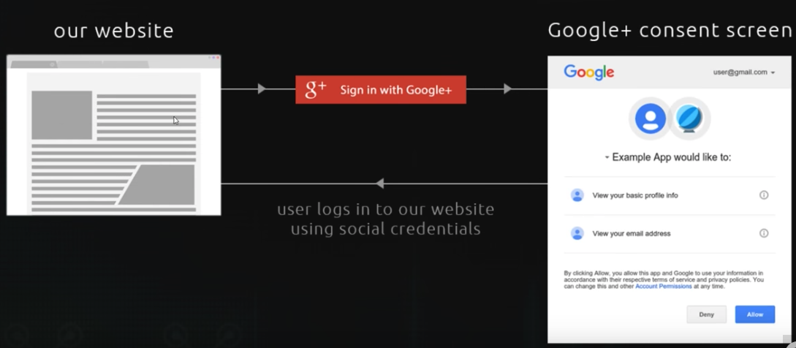
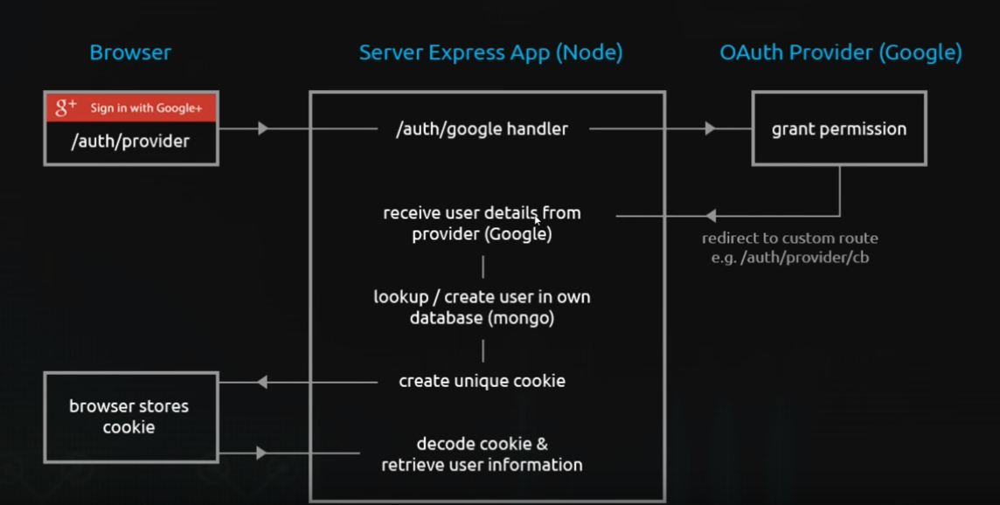

## Oauth Application

This is an  **Oauth Application** created from scratch.

### Experience this Application!  [Live Link ]("https://gentle-cove-28403.herokuapp.com")

Functionalities include :

1. Login Using Google Oauth & PassportJs
2. Save User To Mlab Mongo Database
3. Retrieve User From Database
4. Add Cookie Session 
5. Secure Routes
6. Securely Log User Out 

To Run The Application

`git clone https://github.com/RohitoOo/JWT_Authentication-Oauth_Authentication.git` - Clone The Repo   
`npm install` - Install Dependencies  
`node app` - Run Application

*Make Sure You Have nodeJs Installed Locally*

Personal Portfolio
-------------------

[Rohit Bhambhani](http://rohito.com)